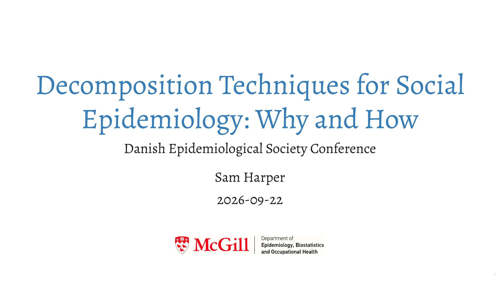

Presentation given at the Danish Epidemiological Society Conference, Nyborg, Denmark, Sept 22, 2026.

Below you can access the slides.

:::columns
::: {.column width="45%"}

 [HTML version](https://samharper.org/des-decomp) 

{width=50%}
:::

::: {.column width="45%"}

 [PDF version](des-decomp.pdf) 

{width=30%}
:::

:::
